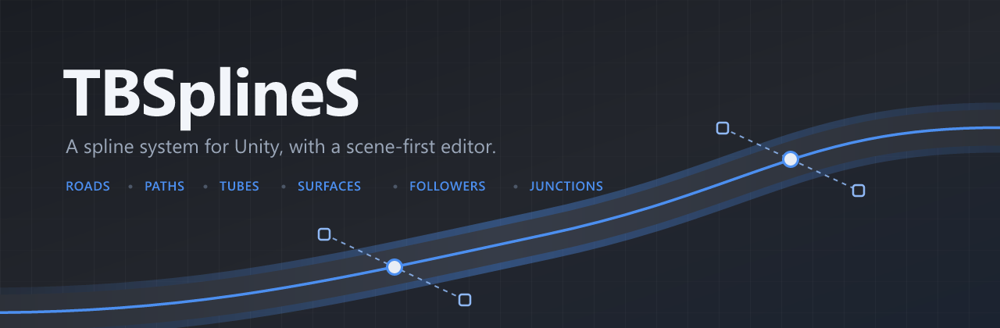

<div align="center">



<br>

[](../../releases)
[](https://unity.com)
[](#asset-store)

**Draw splines in the scene view. Build roads, paths, tubes, fences and surfaces along them.**

</div>

---

TBSplineS is a spline system built around the scene view rather than the inspector. You
draw a path by clicking in the scene, drag its points and handles directly, and the
geometry, colliders and moving objects attached to it update as you go.

The runtime has **no dependencies** and **no render pipeline requirement** — it works
the same on Built-in, URP and HDRP.

## Install

**Package Manager → + → Install package from git URL:**

```
https://github.com/AlexDeKarlo/tbsplines.git
```

**Or in `Packages/manifest.json`:**

```json
{
  "dependencies": {
    "com.thebestsplinesolution.core": "https://github.com/AlexDeKarlo/tbsplines.git"
  }
}
```

That installs the current state of the package. Unity records the exact commit in
`Packages/packages-lock.json`, so your project stays put until you ask for a newer one —
remove the entry from that file, or re-add the package, to pull the latest again.

Need a version that can never move? Append a tag, for example
`https://github.com/AlexDeKarlo/tbsplines.git#v0.1.1`. See the
[releases](../../releases) for the list.

Prefer a plain folder in `Assets/`? Download the `.unitypackage` from the
[latest release](../../releases).

## Quick start

```
1.  GameObject → TBSplineS → Spline Computer
2.  Hit Edit in the inspector, then click in the scene view to place points
3.  Add a Path Generator to the same object          → a road appears along the spline
4.  Add a Spline Follower to any object, point it at the computer
```

Want to see it working first? Open the package in the Package Manager and press **Import**
next to the **Examples** sample: nine annotated sections in one scene, covering roads,
rings, forks, meshes, fences, modifiers, surfaces, physics and utility components. Nothing
lands in your project until you ask for it, and the sample is a plain copy you can edit or
delete freely.

The `.unitypackage` attached to every [release](../../releases) has the same demo scene
already unpacked, for projects that install by dropping a folder into `Assets/`.

## Components

| | Component | What it does |
|:--:|---|---|
|  | **Spline Computer** | Owns the splines, junctions and caches. Everything else reads from it. |
|  | **Path Generator** | A flat ribbon along the spline. Roads, tracks, walkways, with an optional shaped cross-section for gutters and camber. |
|  | **Tube Generator** | A tube, pipe or cable. Revolve it less than a full turn for a trough or half-pipe. |
|  | **Surface Generator** | Fills the area inside a closed spline. Lakes, plazas, platforms, extruded into solids. |
|  | **Spline Mesh** | Repeats *your* meshes along the spline, bent to the curve or placed as props. Layer channels to build a fence out of rails and posts at once. |
|  | **Spline Follower** | Moves an object along the spline at a real-world speed, with speed regions and branch switching at junctions. |
|  | **Spline Positioner** | Pins an object to a fixed point on the spline. |
|  | **Spline Projector** | Snaps an object to the nearest point on the spline, and reports how far along it is. |
|  | **Spline Trigger** | Fires events when a follower passes a point. Checkpoints, laps, gates. |
|  | **Object Controller** | Scatters prefabs along the spline, with seeded randomness so the layout is reproducible. |
|  | **Box Collider Generator** | A chain of box colliders along the spline. Cheaper than a mesh collider. |
|  | **Edge Collider 2D Generator** | Physics for 2D ground and rails. |
|  | **Length Calculator** | Measures the spline and raises events when its length crosses a threshold. |

## Editing

The scene editor is the point of the package, not an afterthought.

- **Click** to place a point, **drag** to move it, **Ctrl+Click** to delete.
- **Shift+Click** for multi-select, **drag on empty space** for a box selection.
- **Right-click a curve** to insert a point there, or open the context menu.
- **Drag one spline's endpoint onto another** to connect them into a junction.
- **Shift+Scroll** cycles the add mode: append, prepend, insert.
- Grid snapping with height guides, per-point roll, and per-point width and colour.
- Bezier, Catmull-Rom, B-spline and linear, switchable per spline at any time.

## Scripting

Every public type carries XML documentation, so the API explains itself in your IDE.

```csharp
using TBSplineS;
using UnityEngine;

public class Patrol : MonoBehaviour
{
    public TbsSplineComputer computer;
    public float speed = 4f;

    float _t;

    void Update()
    {
        // Travel converts a real-world distance into a position along the spline,
        // so the pace stays constant no matter how the points are spaced.
        _t = computer.Travel(0, _t, speed * Time.deltaTime);

        TbsSample sample = default;
        computer.Evaluate(0, _t, ref sample);

        transform.SetPositionAndRotation(sample.Position, sample.Rotation);
    }
}
```

Building your own geometry takes one override — derive from `TbsMeshGenerator` and
implement `GenerateMesh`. Width, colour, UVs, normals, double-siding and mesh collider
handling are already done for you.

**Assemblies:** `TBSplineS` (runtime, auto-referenced) and `TBSplineS.Editor`.

## Asset Store

**Coming soon.** A TBSplineS edition is on its way to the Unity Asset Store, together
with add-ons that build on this core — roads and more.

This package stays free and stays here. It is not a trial or a crippled build: nothing
is time-limited, watermarked or held back, and it will keep receiving updates on its
own. The Asset Store edition adds tooling on top of it rather than replacing it.

Watch the repository to hear when it lands.

## Compatibility

| | |
|---|---|
| Unity | 2022.3 LTS and newer, including Unity 6 |
| Pipelines | Built-in, URP, HDRP — the core generates plain meshes |
| Platforms | No platform-specific code |
| Dependencies | None |

## License

**Free to use**, in personal and commercial projects alike, with no royalty. Ship your
game, paid or free, on any platform. Extend the package however you like, and share an
extension for free if you want to.

What you may **not** do is sell it, or sell tools built on it: TBSplineS itself may not
be redistributed, and add-ons, plugins or tool packs that depend on it may not be put
up for sale. Your game is yours to sell; developer tools built on TBSplineS are not.

Full terms in [LICENSE.md](LICENSE.md).
